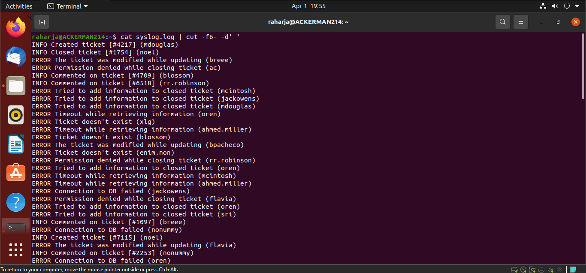
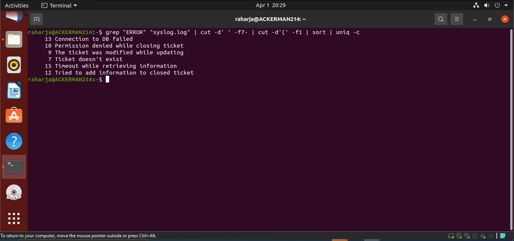
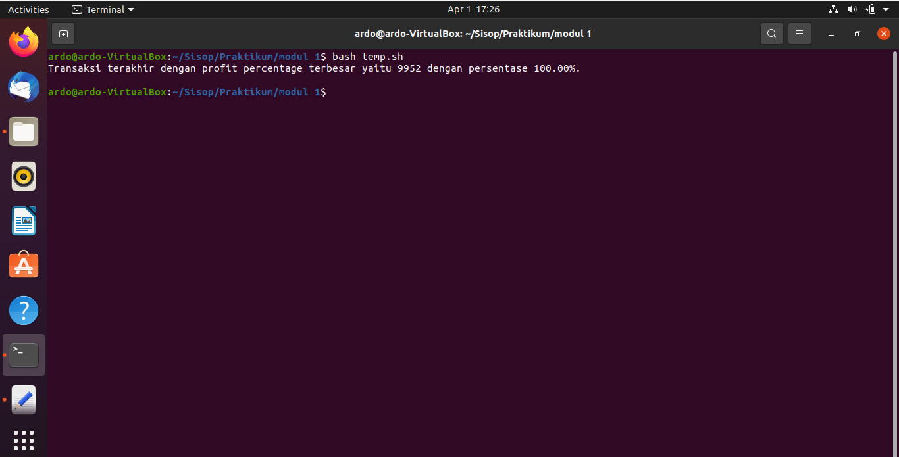
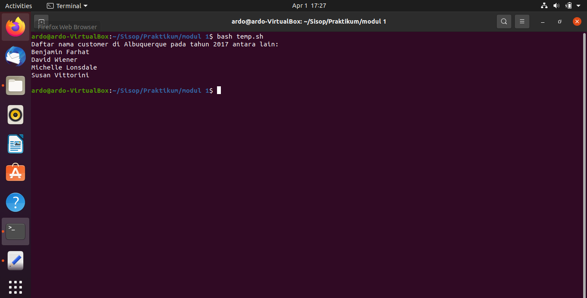
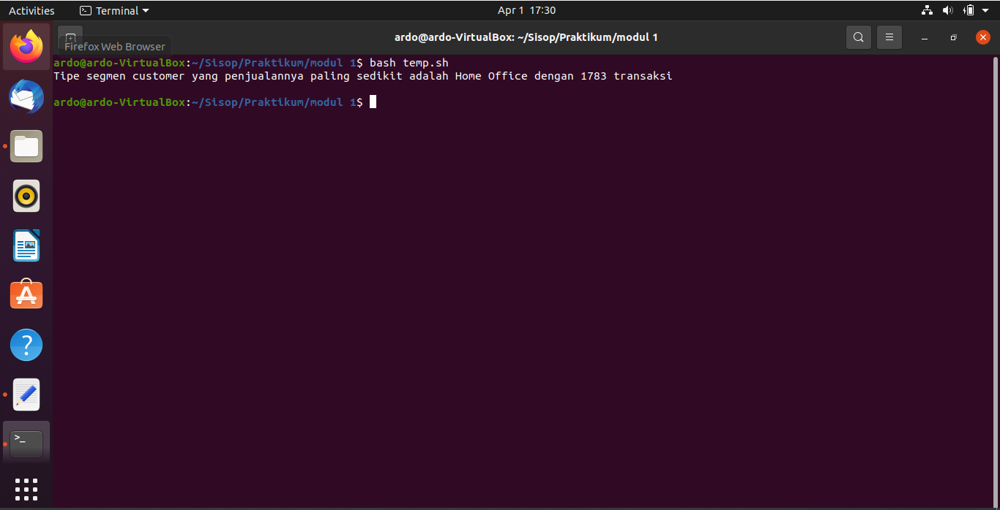
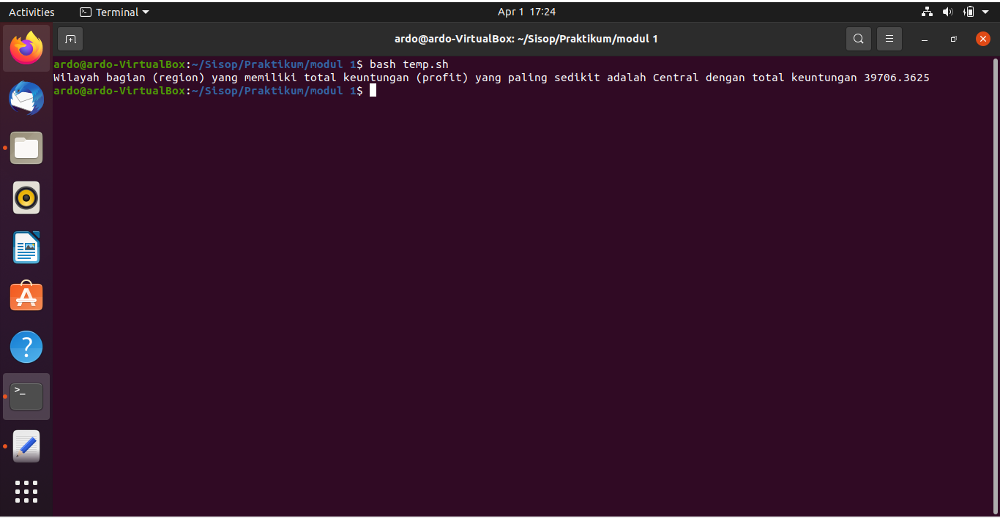

# soal-shift-sisop-modul-1-F05-2021

# Soal 1
## Soal 1A
Mengumpulkan informasi dari log aplikasi yang terdapat pada file syslog.log. 
Informasi yang diperlukan antara lain: jenis log (ERROR/INFO), pesan log, dan username pada setiap baris lognya.<br><br>

Untuk menjawab sub-soal, dimasukkan perintah :
```
log=`cat syslog.log | cut -f6- -d' '`
```

Pada baris diatas, pertama - tama dijalankannya perintah `cat syslog.log`. Perintah ini berfungsi sebagai menampilkan data - data yang ada di file `sylog.log` tersebut.<br>
Setelah itu, dilakukan **pipe(|)** dari output perintah yang pertama menuju ke perintah `cut -f6- -d' '`.<br><br>

Perintah `cut -f6- -d' '` digunakan untuk memotong output yang sudah didapatkan dari perintah sebelumnya berdasarkan pada karakter spasi (" ").
Kemudian, dari hasil potongan tersebut, diambil ***field ke 6 hingga terakhir*** untuk mendapatkan nilai **jenis log**, **pesan log**, dan **username**
dari setiap baris tersebut.<br><br> 

Berikut merupakan tampilan Output apabila script sub-soal dijalankan pada shell, sebagai berikut :<br>


## Soal 1B
Bisa menampilkan semua pesan error yang muncul yang muncul beserta jumlah kemunculannya.<br><br>

Untuk menjawab sub-soal, dimasukkan perintah :
```
err=`grep "ERROR" "syslog.log" | cut -d' ' -f7- | cut -d'(' -f1 | sort | uniq -c`<br>
```

Pada baris diatas, pertama - tama dijalankan perintah `grep "ERROR" "syslog.log"`. Perintah ini berfungsi untuk mengambil data dari suatu baris yang memiliki
string "Error" didalamnya dari file syslog.log.<br>
Setelah itu, dilakukan **pipe (|)** dari output perintah pertama menuju ke perintah `cut -d' ' -f7-`.<br><br>

Pada perintah `cut -d' ' -f7-`, hasil string yang didapatkan pada perintah pertama akan dipotong dengan mengacu pada 
karakter spasi (" "). Kemudian dari hasil potongan tersebut, diambil ***field ke 7 hingga terakhir*** sehingga 
diperoleh data **tipe error** dan **username** baris.<br>
Setelah itu, dilakukan **pipe (|)** dari output perintah kedua ini menuju ke perintah `cut -d'(' -f1`.<br><br>

Pada perintah `cut -d'(' -f1`, hasil string dari perintah kedua akan dipotong kembali dengan mengacu pada karakter
buka kurung ("("). Kemudian dari hasil pemotongan tersebut, diambil ***field pertama*** hasil pemotongan sehingga
data string yang tersisa hanyalah **tipe error** pada baris tersebut saja.<br>
Setelah itu, dilakukan **pipe (|)** sekali lagi dari output perintah ketiga menuju ke perintah `sort | uniq -c`.<br><br>

Pada perintah `sort | uniq -c`, hasil string perintah ketiga kemudian akan di sorting sesuai dengan namanya dan dilakukan pipe-ing terakhir
menuju perintah uniq -c untuk menghitung jumlah kemunculan unique string yang telah diurutkan tersebut.

Berikut merupakan tampilan Output apabila script sub-soal dijalankan pada shell, sebagai berikut :<br>


## Soal 1C
Bisa menampilkan jumlah kemunculan log ERROR dan INFO untuk setiap user-nya.<br><br>

Untuk menjawab sub-soal, dimasukkan perintah :
```
counterr=`grep "ERROR" "syslog.log"| cut -d'(' -f2 | cut -d')' -f1 | sort | uniq -c`
```

Pada baris diatas, pertama - tama dijalankan perintah `grep "ERROR" "syslog.log"`. Perintah ini berfungsi untuk mengambil data suatu baris yang memiliki
string "Error" didalamnya dari file syslog.log.<br>
Setelah itu, dilakukan **pipe (|)** dari output perintah pertama menuju perintah `cut -d'(' -f2`.<br><br>

Pada perintah `cut -d'(' -f2`, hasil string yang didapatkan pada perintah pertama akan dipotong dengan mengacu pada 
karakter ("("). Kemudian dari hasil potongan tersebut, diambil ***field ke 2 hingga pertama*** sehingga 
diperoleh data **username** baris. Namun masih ada karakter (")"), setelah itu dilakukan **pipe (|)** dari output perintah kedua ini menuju ke perintah `cut -d')' -f1`.<br><br>

Pada perintah `cut -d')' -f1`, hasil string dari perintah kedua akan dipotong kembali dengan mengacu pada karakter
tutup kurung (")"). Kemudian dari hasil pemotongan tersebut, diambil ***field pertama*** hasil pemotongan sehingga
data string yang tersisa hanyalah **username** pada baris tersebut saja.<br>
Setelah itu, dilakukan **pipe (|)** sekali lagi dari output perintah ketiga menuju ke perintah `sort | uniq -c`.<br><br>

Pada perintah `sort | uniq -c`, hasil string perintah ketiga kemudian akan di sorting sesuai dengan namanya dan dilakukan pipe-ing terakhir
menuju perintah uniq -c untuk menghitung jumlah kemunculan unique string yang telah diurutkan tersebut.<br><br>

Untuk menampilkan jumlah kemunculan log INFO, kita bisa menggunakan perintah serupa dengan perintah untuk menampilkan jumlah log ERROR :
```
countin=`grep "INFO" "syslog.log"| cut -d'(' -f2 | cut -d')' -f1 | sort | uniq -c`
```

Berikut merupakan tampilan Output apabila script sub-soal dijalankan pada shell, sebagai berikut :<br>


## Soal 1D
Belum bisa tranfer data ke csv. 

## Soal 1E
Belum bisa tranfer data dari ke csv. 

# Soal 2
Soal ini menggunakan data yang berasal dari *laporan-TokoShiSop.tsv* yang telah disediakan.<br>
Karena file berformat *tsv*, maka pada setiap sub-soal, AWK diinisiasi dengan menggunakan command :
```
LC_ALL=C awk -F '\t' ' 
```
`LC_ALL=C` digunakan sebagai *pre-caution* agar awk dapat membaca angka desimal pada data dengan benar. Hal ini berkaitan dengan penggunaan tanda titik (.) atau tanda koma (,) sebagai representasi tanda desimal.<br>
Sedangakan untuk `awk -F '\t'`, digunakan untuk menginisiasi awk sekaligus menetapkan nilai **tab (\t)** sebagai *field separator* (melihat file berformat *tsv*).<br><br>
## Soal 2a
Carilah *Row ID* beserta dengan *Profit Percentage* terbesar pada data (jika hasil *profit percentage* terbesar lebih dari 1, ambil data yang memiliki **Row ID** yang paling besar).<br><br> 
Dimana **profit percentage** dapat dicari dengan cara :
```
Profit Percentage =  (Profit : (Sales - Profit) x 100
```
Pada sub-soal ini, di bagian begin terdapat command :
```
BEGIN{
	maxPP = 0
	maxRID = 0
	isFirst = 1
	}
```
Command diatas digunakan untuk menginisiasi variabel tertentu yang akan digunakan untuk membantu jalannya program.<br>
`maxPP` digunakan untuk menyimpan nilai maksimum *Profit Percentage*. `maxRID` digunakan untuk menyimpan nilai maksimum *Row ID*. `isFirst` digunakan sebagai variabel pembantu untuk menginisiasi kedua variabel lainnya.<br><br>
 
 Pada bagian *action* awk, terdapat command :
 ```
 {
	if(NR != 1){
		profitPercentage = ($21/($18-$21))
		if(isFirst == 1){
			maxPP = profitPercentage
			maxRID = $1
			isFirst = 0
		}
		else{
			if(profitPercentage >= maxPP){
				maxPP = profitPercentage
				maxRID = $1
			}
		} 
	}
}			
```
Maksud dari kumpulan command diatas adalah, jika `NR` atau Number of Row tidak sama dengan 1 (artinya bukan header), maka hitung nilai `profitPercentage`
dengan menggunakan rumus `profitPercentage = ($21/($18-$21))`.Dimana `$21` adalah parameter *profit* dan `$18` adalah paramater *sales* yang didapatkan dari hasil 
***field separator karakter tab*** pada file yang disediakan Kemudian cek, jika ini merupakan hasil perhitungan pertama kali, maka masukkan nilai perhitungan
`profitPercentage` sebagai `maxPP` dan `RID ($1)` baris tersebut sebagai maxRID. Tujuannya adalah agar terdapat nilai yang dapat digunakan sebagai pembanding
untuk perhitungan nilai `profitPercentage` baris berikutnya. Kemudian, jika sudah bukan baris pertama lagi, maka berlaku perbandingan `profitPercentage >= maxPP`
untuk menentukan siapa yang memiliki `profiPercentage` yang paling besar.<br><br>

Pada bagian akhir script, terdapat command :
```
END{
printf "Transaksi terakhir dengan profit percentage terbesar yaitu %d dengan persentase %.2f%%.\n\n", maxRID, maxPP*100
}
' Laporan-TokoShiSop.tsv > hasil.txt
```
Tujuannya adalah untuk menuliskan output yang didapatkan sesuai dengan format tersebut. Sedangkan untuk `Laporan-TokoShiSop.tsv > hasil.txt`, *Laporan-TokoShiSop.tsv* adalah
source file data yang digunakan pada operasi awk, dan `> hasil.txt` digunakan untuk mengirimkan hasil output script kedalam file **hasil.txt**<br><br>

Output yang ditampilkan apabila script sub-soal dijalankan pada shell adalah sebagai berikut :<br>


## Soal 2b
Carilah nama customer pada transaksi tahun **2017** dan berdomisili di **Albuquerque**<br><br>
Pada bagian *action* awk, terdapat command :
```
{	
	split($3,dateTime,"-")
	if(dateTime[3] == "17" && $10 == "Albuquerque"){
		names[$7] 	
	}
} 	
```
Perintah pertama adalah `split($3,dateTime,"-")`, yang tujuannya untuk membagi string yang terdapat pada kolom *Ship Date ($3)* berdasarkan karakter *-* dan kemudian
memasukkan hasil pemisahan string-nya ke dalam array **dateTime**. Karena yang diminta adalah data transaksi pada tahun 2017, menyesuaikan dengan format data yang ada
pada kolom yaitu `dd-mm-yy`, maka digunakan perintah `dateTime[3] == "17"` untuk menyocokkan tahunnya dan peritah `$10 == "Albuquerque"` untuk menyesuaikan nama kota
yang diminta. Jika ditemukan data yang sesuai dengan syarat, dijalankan perintah `names[$7]` yang berfungsi untuk memasukkan nama orang yang terdapat di kolom 7 data ($7)
menjadi sebuah *key* di array *names*<br><br>

Kemudian pada bagian akhir  AWK, terdapat perintah :
``` 
END{
	printf "Daftar nama customer di Albuquerque pada tahun 2017 antara lain:\n"
		for(name in names){
			printf "%s\n", name
		}
	printf "\n"	
}
' Laporan-TokoShiSop.tsv >> hasil.txt
```

Di bagian `END` tersebut, perintah yang tertulis digunakan untuk menuliskan output yang didapatkan sesuai dengan format
yang diminta. Sedangkan untuk `Laporan-TokoShiSop.tsv >> hasil.txt`, *Laporan-TokoShiSop.tsv* adalah
source file data yang digunakan pada operasi awk, dan `>> hasil.txt` digunakan untuk mengirimkan hasil output script kedalam 
file **hasil.txt** tanpa menghapus konten yang sudah ada sebelumnya di **hasil.txt**.<br><br>

Output yang ditampilkan apabila script sub-soal dijalankan pada shell adalah sebagai berikut :<br>


## Soal 2C
Carilah data **segment customer** yang memiliki **jumlah transaksi yang paling sedikit**.<br><br>
Pada bagian *action* awk, terdapat command :
```
{	
	if(NR != 1){
		arr[$8]++
	}
}
```
Pada bagian ini, operasi yang dilakukan adalah untuk mengumpulkan *jumlah segment customer* keseluruhan yang ada berdasarkan nama 
segment customer-nya($8) sendiri - sendiri. Syarat yang dikenakan adalah, apabila baris tersebut bukanlah baris header dari File. <br><br>

Pada bagian akhir script AWK, terdapat command :
```
END{
	isFirst = 1;
	for(types in arr) {  
		if (isFirst == 1){
			min = arr[types]
			minTypes = types
			isFirst = 0
			continue
		}
		else if (arr[types] < min){
			minTypes = types
			min = arr[types]
		}
	}
	printf "Tipe segmen customer yang penjualannya paling sedikit adalah %s dengan %d transaksi\n\n", minTypes, min		
}
' Laporan-TokoShiSop.tsv >> hasil.txt
```
Varibel `isFirst` digunakan untuk membantu mengecek apakah data merupakan data pertama.	Di dalam perulangan elemen array yang ada, pertama - tama
dilakukan pengecekan. Jika data adalah data pertama, maka dilakukan inisiasi nilai minimal secara keseluruhan dengan menggunakan nilai data ke-1 tersebut, yang nantinya
akan digunakan untuk dibandingkan dengan data lainnya. Jika data bukan data pertama pada array, maka data tersebut akan dibandingkan dengan
nilai minimal yang telah ditetapkan sebelumnya. Jika data ke-i ternyata lebih kecil, maka nilai minimal dari array akan diubah dengan 
menggunakan data ke-i.<br><br>
Setelah selesai dilakukan pengecekkan seluruh elemen yang ada pada array, tuliskan output yang didapatkan sesuai dengan format
yang diminta. Sedangkan untuk `Laporan-TokoShiSop.tsv >> hasil.txt`, *Laporan-TokoShiSop.tsv* adalah
source file data yang digunakan pada operasi awk, dan `>> hasil.txt` digunakan untuk mengirimkan hasil output script kedalam 
file **hasil.txt** tanpa menghapus konten yang sudah ada sebelumnya di **hasil.txt**.<br><br>

Output yang ditampilkan apabila script sub-soal dijalankan pada shell adalah sebagai berikut :<br>


## Soal 2d
Carilah **region yang memiliki total profit yang paling sedikit** beserta dengan **total profitnya**.<br><br>
Pada bagian *action* awk, terdapat command :
```
{	
	if(NR != 1){
		arr[$13]+=$21
	}
}
```
Pada bagian ini, operasi yang dilakukan adalah untuk mengumpulkan **jumlah total profit dari masing - masing region** ke dalam sebuah array, dimana nama region ($13) 
dijadikan sebagai *key* dari tiap element, sedangkan *value* untuk tiap element didapatkan dengan menambahkan profit ($21) dari masing - masing region tersebut ke dalam array. 
Syarat yang dikenakan adalah, apabila baris tersebut bukanlah baris header dari File. <br><br>

Pada bagian akhir script AWK, terdapat command :
```
END{
	isFirst = 1
	for(region in arr){
		if (isFirst == 1){
			min = arr[region]
			minRegion = region
			isFirst = 0
			continue
		}
		else if (arr[region] < min){
			minRegion = region
			min = arr[region]
		}
	}
	printf "Wilayah bagian (region) yang memiliki total keuntungan (profit) yang paling sedikit adalah %s dengan total keuntungan %.4f\n", minRegion, min		
}
' Laporan-TokoShiSop.tsv >> hasil.txt
```
Varibel `isFirst` digunakan untuk membantu mengecek apakah data merupakan data pertama.	Di dalam perulangan elemen array yang ada, pertama - tama
dilakukan pengecekan. Jika data adalah data pertama, maka dilakukan inisiasi nilai minimal secara keseluruhan dengan menggunakan nilai data ke-1 tersebut, yang nantinya
akan digunakan untuk dibandingkan dengan data lainnya. Jika data bukan data pertama pada array, maka data tersebut akan dibandingkan dengan
nilai minimal yang telah ditetapkan sebelumnya. Jika data ke-i ternyata lebih kecil, maka nilai minimal dari array akan diubah dengan 
menggunakan data ke-i.<br><br>
Setelah selesai dilakukan pengecekkan seluruh elemen yang ada pada array, tuliskan output yang didapatkan sesuai dengan format
yang diminta. Sedangkan untuk `Laporan-TokoShiSop.tsv >> hasil.txt`, *Laporan-TokoShiSop.tsv* adalah
source file data yang digunakan pada operasi awk, dan `>> hasil.txt` digunakan untuk mengirimkan hasil output script kedalam 
file **hasil.txt** tanpa menghapus konten yang sudah ada sebelumnya di **hasil.txt**.<br><br>

Output yang ditampilkan apabila script sub-soal dijalankan pada shell adalah sebagai berikut :<br>


## Soal 2e
Membuat file dengan judul "**hasil.txt**" yang berisi kumpulan hasil jawaban dari script sebelumnya.<br><br>

Proses ini telah dilakukan setiap sebuah script solusi dari sub-soal dijalankan. Sebagai catatan, terdapat dua operator ***redirection*** yang digunakan.
Yang pertama adalah operator `>` untuk mengoverwrite seluruh konten yang sebelumnya ada di file tujuan dengan output yang didapatkan dari script. Operator ini digunakan pada sub-soal 2a. <br>
Sedangkan operator redirection yang kedua adalah `>>`, digunakan untuk menambahkan hasil output script yang didapatkan ke halaman akhir file tujuan tanpa melakukan overwriting. Operator ini
digunakan pada soal 2b,2c,dan 2d.<br><br>


# Soal 3
## soal 3a
Untuk mendowload file dari ```https://loremflickr.com/320/240/kitten``` kita dapat menggunakan perintah ```wget -a $PWD/Foto.log -O $PWD/"Koleksi_0$i"```serta akan menyimpan log ke dalam file __Foto.log__

```
#DOWNLOAD 23 FOTO DENGAN PENAMAAN YANG SESUAI
count=23
i=1
b=9
  for i in $(seq $count); 
  do
	if [ $i -le $b ]
	then
	wget -a $PWD/Foto.log -O $PWD/"Koleksi_0$i" https://loremflickr.com/320/240/kitten
 	else 
	wget -a $PWD/Foto.log -O $PWD/"Koleksi_$i" https://loremflickr.com/320/240/kitten
	fi
  done
```
Karena gambar yang didownload random, akan ada kemungkinan gambarnya sama, untuk mengecek hal itu kita bisa melihat dari file __Foto.log__. Dengan mencari nilai situs yang sama dari file __Foto.log__ dengan menggunakan ```awk``` pada sebuah array ```myarray``` sebagai berikut: ```myarray=($(awk '/Location/ {print $2}' $PWD/Foto.log))```
lalu lakukan pemeriksaan dengan looping.
```
for ((i=0 ;i<23;i++))
do
for ((j=0 ;j<=i;j++))
do 
if [[ "$j" != "$i" && "${myarray[$j]}" == "${myarray[$i]}" ]]; then
	del=$((j+1))	
	if [ $del -le 9 ];
	then 
	rm -f $PWD/Koleksi_0$del
	else	
	rm -f $PWD/Koleksi_$del
	fi
fi
done
done
```
## soal 3b
untuk membuat crontab untuk __setiap tanggal 1 tujuh hari sekali (1,8,...)__ serta dari tanggal __2 empat hari sekali (2,6,...)__ bisa dengan
```  
20 1-31/7,2-31/4 * * bash ./home/juned/soal3b.sh
```
sedangkan untuk memindahkan file kita bisa memindahkan file gambar yang telah diunduh beserta log-nya, dipindahkan ke folder dengan nama tanggal unduhnya dengan format "DD-MM-YYYY" bisa dengan script ```soal3b.sh``` berikut 
```
#!/bin/bash

PWD=`pwd`

bash soal3a.sh
now=$(date +"%d-%m-%Y")
mkdir "$now"

mv ./Koleksi_* "./$now"
mv ./Foto.log "./$now"
```

## soal 3c

Untuk soal ini kita diminta untuk mendownload gambar kucing dan kelinci secara bergantian tiap hari kemudian di simpan dalam folder Kucing_%mm%dd%Y untuk gambar kucing dan Kelinci_%mm%dd%Y untuk gambar kelinci. maka diawal script perlu diperiksa nama folder yang telah didownload (pada hari sebelumnya), jika filenya adalah kucing maka akan di download gambar kelinci begitu juga sebaliknya. Karena diminta untuk mendownload gambar kelinci kita bisa membuat command yang mirip seperti __soal3a.sh__ hanya mengganti link setelah ```wget```.
``` wget -a $PWD/Foto.log -O $PWD/"Koleksi_0$i" https://loremflickr.com/320/240/bunny```

Karena kita diminta memindahkan file ke folder yang bernama sesuai dengan tanggal di download
maka dapat menggunakan command berikut
```
mv ./Koleksi_* "./Kucing_$now"
mv ./Foto.log "./Kucing_$now"
```
Dan berikut adalah keseluruhan dari __soal3c.sh__
```
#!/bin/bash

PWD=`pwd`

now=$(date +"%d-%m-%Y")
yes=$(date -d yesterday +"%d-%m-%Y")

kuckem="/Kucing_$yes"
if [ -d "$kuckem" ] 
then 
mkdir "Kelinci_$now"
#DOWNLOAD 23 FOTO DENGAN PENAMAAN YANG SESUAI
count=24
i=1
b=9
  for i in $(seq $count); 
  do
	if [ $i -le $b ]
	then
	wget -a $PWD/Foto.log -O $PWD/"Koleksi_0$i" https://loremflickr.com/320/240/bunny
 	else 
	wget -a $PWD/Foto.log -O $PWD/"Koleksi_$i" https://loremflickr.com/320/240/bunny
	fi
  done
#HAPUS YANG DUPLICATE
myarray=($(awk '/Location/ {print $2}' $PWD/Foto.log))

for ((i=0 ;i<23;i++))
do
for ((j=0 ;j<=i;j++))
do 
if [[ "$j" != "$i" && "${myarray[$j]}" == "${myarray[$i]}" ]]; then
	del=$((j+1))	
	if [ $del -le 9 ];
	then 
	rm $PWD/Koleksi_0$del
	else	
	rm $PWD/Koleksi_$del
	fi
fi
done
done
mv ./Koleksi_* "./Kelinci_$now"
mv ./Foto.log "./Kelinci_$now"

else 
mkdir "Kucing_$now"
#DOWNLOAD 23 FOTO DENGAN PENAMAAN YANG SESUAI
count=24
i=1
b=9
  for i in $(seq $count); 
  do
	if [ $i -le $b ]
	then
	wget -a $PWD/Foto.log -O $PWD/"Koleksi_0$i" https://loremflickr.com/320/240/kitten
 	else 
	wget -a $PWD/Foto.log -O $PWD/"Koleksi_$i" https://loremflickr.com/320/240/kitten
	fi
  done
#HAPUS YANG DUPLICATE
myarray=($(awk '/Location/ {print $2}' $PWD/Foto.log))

for ((i=0 ;i<23;i++))
do
for ((j=0 ;j<=i;j++))
do 
if [[ "$j" != "$i" && "${myarray[$j]}" == "${myarray[$i]}" ]]; then
	del=$((j+1))	
	if [ $del -le 9 ];
	then 
	rm $PWD/Koleksi_0$del
	else	
	rm $PWD/Koleksi_$del
	fi
fi
done
done
mv ./Koleksi_* "./Kucing_$now"
mv ./Foto.log "./Kucing_$now"


fi
```

## soal 3d
Untuk diminta men-zip semua folder kucing dan kelinci dan memberi password sesuai tanggal hari dimana dilakukan zipping
```
#!/bin/bash

PWD=`pwd`

now=$(date +"%m%d%Y")
echo $now
zip -P $now Koleksi.zip -r ./Kucing* ./Kelinci*
```
## soal 3e
Untuk soal ini kita diminta menjadwalkan yaitu setiap hari kecuali sabtu dan minggu, dari jam 7 pagi sampai 6 sore, ia memintamu untuk membuat koleksinya ter-zip saat kuliah saja, selain dari waktu yang disebutkan,semua folder ter-unzip dan tidak ada file zip sama sekali.
```
0 7 * * 1-5 zip -P `date +"%m%d%Y"` -r Koleksi.zip ./Kucing* ./Kelinci*
0 18 * * 1-5 unzip  -P `date +"%m%d%Y"` -r Koleksi.zip && rm Koleksi.zip
```


